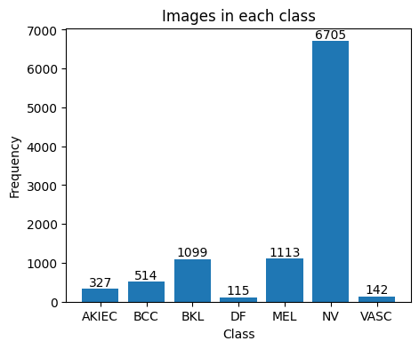
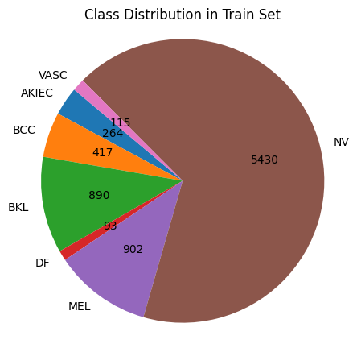
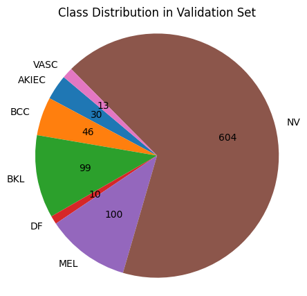
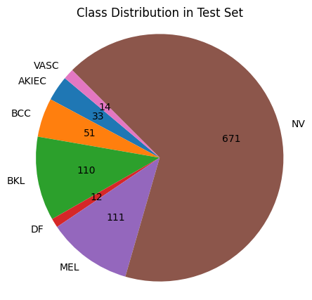
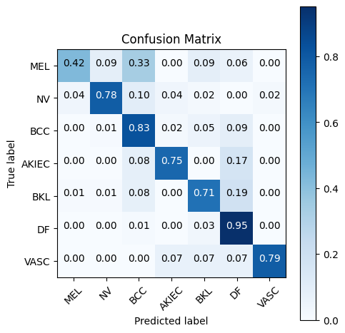
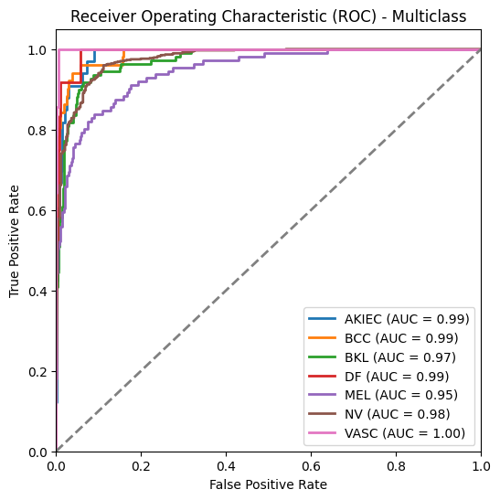
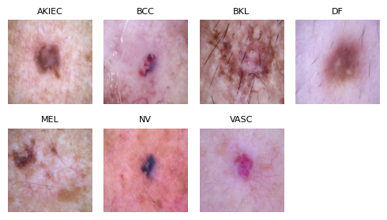
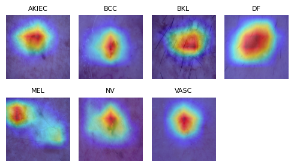

```python
from google.colab import drive
drive.mount('/content/drive')
```

    Mounted at /content/drive


```python
import os
import shutil
import numpy as np
import pandas as pd
import tensorflow as tf
import matplotlib.pyplot as plt
import seaborn as sns
import cv2
import sklearn
from sklearn.metrics import classification_report
from keras.applications import *
from keras.layers import *
from keras.models import Model, load_model
from keras.optimizers import Adam
from sklearn.utils import class_weight
from tqdm import tqdm
from keras.preprocessing.image import ImageDataGenerator
from keras.applications.efficientnet_v2 import preprocess_input as base_preprocess
from keras.callbacks import ReduceLROnPlateau, EarlyStopping, ModelCheckpoint
from sklearn.metrics import classification_report, confusion_matrix, roc_auc_score, roc_curve, RocCurveDisplay, auc
from sklearn.utils.multiclass import unique_labels
from collections import Counter
from pathlib import Path
from sklearn.model_selection import train_test_split
from keras.utils import to_categorical
from PIL import Image
from sklearn.preprocessing import LabelEncoder
from sklearn.utils.class_weight import compute_class_weight
import itertools
```

**Load data**


```python
data = np.load('/content/drive/MyDrive/SC Lab/Dataset/data.npy',mmap_mode='r')
labels = np.load('/content/drive/MyDrive/SC Lab/Dataset/labels.npy',mmap_mode='r')
```


```python
print("Data shape:", data.shape)
print("Labels shape:", labels.shape)
```

    Data shape: (10015, 224, 224, 3)
    Labels shape: (10015, 7)


Loading Images from the data


```python
# Get unique class labels and their corresponding indices in the data array
unique_classes = np.unique(labels, axis=1)

# Create a dictionary to store one data sample from each class
class_samples = {}

# Map class indices to their corresponding names
class_names = {0: "AKIEC", 1: "BCC", 2: "BKL", 3: "DF", 4: "MEL", 5: "NV", 6: "VASC"}

# Select one data sample from each class
for class_label in unique_classes:
    class_indices = np.where(np.all(labels == class_label, axis=1))[0]
    class_samples[tuple(class_label)] = data[class_indices[0]]

# Plot the images in 2 rows
plt.figure(figsize=(5, 3))
for i, (class_label, image_data) in enumerate(class_samples.items()):
    class_index = np.argmax(class_label)  # Get the index of the class
    class_name = class_names[class_index]  # Get the corresponding class name
    plt.subplot(2, 4, i + 1)
    plt.imshow(image_data)
    plt.title(f'{class_name}')
    plt.axis('off')

plt.tight_layout()
plt.show()
```


    

    


Frequency of the data


```python
# Sum the one-hot encoded labels along the rows to get the frequency of each class
class_counts = np.sum(labels, axis=0)

# Map class indices to their corresponding names
class_names = {0: "AKIEC", 1: "BCC", 2: "BKL", 3: "DF", 4: "MEL", 5: "NV", 6: "VASC"}

# Plot the class frequencies
plt.figure(figsize=(5, 4))
plt.bar([class_names[class_idx] for class_idx in range(len(class_names))], class_counts)
plt.xlabel('Class')
plt.ylabel('Frequency')
plt.title('Images in each class')

# Annotate the bars with the class frequencies (integer format)
for i, count in enumerate(class_counts):
    plt.text(i, count, str(int(count)), ha='center', va='bottom')

plt.show()
```


    

    


Split data


```python
# Split the data into train, test, and validation sets
train_data, test_data, train_labels, test_labels = train_test_split(data, labels, test_size=0.1,stratify=labels, random_state=42)
train_data, val_data, train_labels, val_labels = train_test_split(train_data, train_labels, test_size=0.1,stratify=train_labels, random_state=42)
```

Split Data Frequecy


```python
print("train_data shape:", train_data.shape)
print("train_labels shape:", train_labels.shape)
print("val_data shape:", val_data.shape)
print("val_labels shape:", val_labels.shape)
print("test_data shape:", test_data.shape)
print("test_labels shape:", test_labels.shape)
```

    train_data shape: (8111, 224, 224, 3)
    train_labels shape: (8111, 7)
    val_data shape: (902, 224, 224, 3)
    val_labels shape: (902, 7)
    test_data shape: (1002, 224, 224, 3)
    test_labels shape: (1002, 7)


Data Frequency of Each Class


```python
class_names_mapping = {
    0: "AKIEC",
    1: "BCC",
    2: "BKL",
    3: "DF",
    4: "MEL",
    5: "NV",
    6: "VASC"
}
# Calculate class distribution in each set
num_classes = train_labels.shape[1]
class_counts_train = np.sum(train_labels, axis=0)
class_counts_val = np.sum(val_labels, axis=0)
class_counts_test = np.sum(test_labels, axis=0)

class_counts_mapping = {}
for index, class_name in class_names_mapping.items():
    class_counts_mapping[class_name] = {'Train': class_counts_train[index]}

for index, class_name in class_names_mapping.items():
    class_counts_mapping[class_name]['Validation'] = class_counts_val[index]

for index, class_name in class_names_mapping.items():
    class_counts_mapping[class_name]['Test'] = class_counts_test[index]

# Print class distribution mapping
for class_name, counts in class_counts_mapping.items():
    print(class_name)
    for set_name, count in counts.items():
        print(f" - {set_name}: {count}")
```

    AKIEC
     - Train: 264.0
     - Validation: 30.0
     - Test: 33.0
    BCC
     - Train: 417.0
     - Validation: 46.0
     - Test: 51.0
    BKL
     - Train: 890.0
     - Validation: 99.0
     - Test: 110.0
    DF
     - Train: 93.0
     - Validation: 10.0
     - Test: 12.0
    MEL
     - Train: 902.0
     - Validation: 100.0
     - Test: 111.0
    NV
     - Train: 5430.0
     - Validation: 604.0
     - Test: 671.0
    VASC
     - Train: 115.0
     - Validation: 13.0
     - Test: 14.0


```python
# Create pie charts for each set
for set_name in ['Train']:
    class_counts = [counts[set_name] for counts in class_counts_mapping.values()]
    class_labels = list(class_counts_mapping.keys())

    plt.figure(figsize=(5, 5))
    plt.pie(class_counts, labels=class_labels, startangle=140, autopct=lambda p: '{:.0f}'.format(p * sum(class_counts) / 100))
    plt.title(f'Class Distribution in {set_name} Set')
    plt.axis('equal')  # Equal aspect ratio ensures that pie is drawn as a circle.
    plt.show()
```


    

    


```python
# Create pie charts for each set
for set_name in ['Validation']:
    class_counts = [counts[set_name] for counts in class_counts_mapping.values()]
    class_labels = list(class_counts_mapping.keys())

    plt.figure(figsize=(5, 5))
    plt.pie(class_counts, labels=class_labels, startangle=140, autopct=lambda p: '{:.0f}'.format(p * sum(class_counts) / 100))
    plt.title(f'Class Distribution in {set_name} Set')
    plt.axis('equal')  # Equal aspect ratio ensures that pie is drawn as a circle.
    plt.show()
```


    

    


```python
# Create pie charts for each set
for set_name in ['Test']:
    class_counts = [counts[set_name] for counts in class_counts_mapping.values()]
    class_labels = list(class_counts_mapping.keys())

    plt.figure(figsize=(5, 5))
    plt.pie(class_counts, labels=class_labels, startangle=140, autopct=lambda p: '{:.0f}'.format(p * sum(class_counts) / 100))
    plt.title(f'Class Distribution in {set_name} Set')
    plt.axis('equal')  # Equal aspect ratio ensures that pie is drawn as a circle.
    plt.show()
```


    

    


Augmentation


```python
datagen = ImageDataGenerator(
    rotation_range=20,
    width_shift_range=0.2,
    height_shift_range=0.2,
    shear_range=0.2,
    zoom_range=0.2,
    horizontal_flip=True
)
```

Callbacks


```python
lr_reduce = ReduceLROnPlateau(monitor = 'val_accuracy', factor = 0.5, patience = 5,mode='max', min_lr = 1e-4,verbose = 1)
saved_model = '/content/drive/MyDrive/SC Lab/Saved Model/EfficientNetV2S.h5'
model_chkpt = ModelCheckpoint(saved_model ,save_best_only = True, monitor = 'val_accuracy',verbose = 1)
callback_list = [model_chkpt, lr_reduce]
```

EfficientNetV2S Model


```python
base_model = EfficientNetV2S(weights='imagenet',
                             include_top=False,
                             input_shape=(224, 224, 3))
```

    Downloading data from https://storage.googleapis.com/tensorflow/keras-applications/efficientnet_v2/efficientnetv2-s_notop.h5
    82420632/82420632 [==============================] - 5s 0us/step


```python
x = base_model.output
x = GlobalAveragePooling2D()(x)
x = Dense(128, activation='relu')(x)
x = Dropout(0.5)(x)
predictions = Dense(7, activation='softmax')(x)

model = Model(inputs=base_model.input, outputs=predictions)


# Compile the model
model.compile(optimizer=Adam(learning_rate=0.001),
              loss='categorical_crossentropy',
              metrics=['accuracy'])
```

Model Training


```python
epochs = 50
batch_size = 16
```


```python
history = model.fit(datagen.flow(train_data, train_labels, batch_size=batch_size),
                    validation_data=(val_data, val_labels),
                    epochs=epochs,
                    callbacks=callback_list)
```

    Epoch 1/50
    507/507 [==============================] - ETA: 0s - loss: 0.9378 - accuracy: 0.6825
    Epoch 1: val_accuracy improved from -inf to 0.75610, saving model to /content/drive/MyDrive/4.2/SC Lab/Project/Saved Model/inception.h5
    507/507 [==============================] - 209s 347ms/step - loss: 0.9378 - accuracy: 0.6825 - val_loss: 0.7215 - val_accuracy: 0.7561 - lr: 0.0010
    Epoch 2/50
    507/507 [==============================] - ETA: 0s - loss: 0.7555 - accuracy: 0.7352
    Epoch 2: val_accuracy improved from 0.75610 to 0.78936, saving model to /content/drive/MyDrive/4.2/SC Lab/Project/Saved Model/inception.h5
    507/507 [==============================] - 169s 333ms/step - loss: 0.7555 - accuracy: 0.7352 - val_loss: 0.5886 - val_accuracy: 0.7894 - lr: 0.0010
    Epoch 3/50
    507/507 [==============================] - ETA: 0s - loss: 0.6829 - accuracy: 0.7628
    Epoch 3: val_accuracy did not improve from 0.78936
    507/507 [==============================] - 164s 322ms/step - loss: 0.6829 - accuracy: 0.7628 - val_loss: 0.6311 - val_accuracy: 0.7761 - lr: 0.0010
    Epoch 4/50
    507/507 [==============================] - ETA: 0s - loss: 0.6450 - accuracy: 0.7671
    Epoch 4: val_accuracy did not improve from 0.78936
    507/507 [==============================] - 162s 319ms/step - loss: 0.6450 - accuracy: 0.7671 - val_loss: 0.5845 - val_accuracy: 0.7871 - lr: 0.0010
    Epoch 5/50
    507/507 [==============================] - ETA: 0s - loss: 0.6185 - accuracy: 0.7818
    Epoch 5: val_accuracy improved from 0.78936 to 0.80710, saving model to /content/drive/MyDrive/4.2/SC Lab/Project/Saved Model/inception.h5
    507/507 [==============================] - 173s 342ms/step - loss: 0.6185 - accuracy: 0.7818 - val_loss: 0.5740 - val_accuracy: 0.8071 - lr: 0.0010
    Epoch 6/50
    507/507 [==============================] - ETA: 0s - loss: 0.5877 - accuracy: 0.7908
    Epoch 6: val_accuracy improved from 0.80710 to 0.81264, saving model to /content/drive/MyDrive/4.2/SC Lab/Project/Saved Model/inception.h5
    507/507 [==============================] - 179s 353ms/step - loss: 0.5877 - accuracy: 0.7908 - val_loss: 0.5259 - val_accuracy: 0.8126 - lr: 0.0010
    Epoch 7/50
    507/507 [==============================] - ETA: 0s - loss: 0.5695 - accuracy: 0.7899
    Epoch 7: val_accuracy did not improve from 0.81264
    507/507 [==============================] - 163s 322ms/step - loss: 0.5695 - accuracy: 0.7899 - val_loss: 0.5431 - val_accuracy: 0.8082 - lr: 0.0010
    Epoch 8/50
    507/507 [==============================] - ETA: 0s - loss: 0.5219 - accuracy: 0.8149
    Epoch 8: val_accuracy improved from 0.81264 to 0.82040, saving model to /content/drive/MyDrive/4.2/SC Lab/Project/Saved Model/inception.h5
    507/507 [==============================] - 180s 354ms/step - loss: 0.5219 - accuracy: 0.8149 - val_loss: 0.5281 - val_accuracy: 0.8204 - lr: 0.0010
    Epoch 9/50
    507/507 [==============================] - ETA: 0s - loss: 0.5173 - accuracy: 0.8128
    Epoch 9: val_accuracy improved from 0.82040 to 0.83259, saving model to /content/drive/MyDrive/4.2/SC Lab/Project/Saved Model/inception.h5
    507/507 [==============================] - 181s 358ms/step - loss: 0.5173 - accuracy: 0.8128 - val_loss: 0.4939 - val_accuracy: 0.8326 - lr: 0.0010
    Epoch 10/50
    507/507 [==============================] - ETA: 0s - loss: 0.5095 - accuracy: 0.8169
    Epoch 10: val_accuracy did not improve from 0.83259
    507/507 [==============================] - 163s 320ms/step - loss: 0.5095 - accuracy: 0.8169 - val_loss: 0.4910 - val_accuracy: 0.8282 - lr: 0.0010
    Epoch 11/50
    507/507 [==============================] - ETA: 0s - loss: 0.4783 - accuracy: 0.8299
    Epoch 11: val_accuracy did not improve from 0.83259
    507/507 [==============================] - 163s 321ms/step - loss: 0.4783 - accuracy: 0.8299 - val_loss: 0.4868 - val_accuracy: 0.8271 - lr: 0.0010
    Epoch 12/50
    507/507 [==============================] - ETA: 0s - loss: 0.4512 - accuracy: 0.8386
    Epoch 12: val_accuracy did not improve from 0.83259
    507/507 [==============================] - 164s 322ms/step - loss: 0.4512 - accuracy: 0.8386 - val_loss: 0.5058 - val_accuracy: 0.8237 - lr: 0.0010
    Epoch 13/50
    507/507 [==============================] - ETA: 0s - loss: 0.4401 - accuracy: 0.8449
    Epoch 13: val_accuracy did not improve from 0.83259
    507/507 [==============================] - 168s 330ms/step - loss: 0.4401 - accuracy: 0.8449 - val_loss: 0.4987 - val_accuracy: 0.8304 - lr: 0.0010
    Epoch 14/50
    507/507 [==============================] - ETA: 0s - loss: 0.4305 - accuracy: 0.8486
    Epoch 14: val_accuracy did not improve from 0.83259
    
    Epoch 14: ReduceLROnPlateau reducing learning rate to 0.0005000000237487257.
    507/507 [==============================] - 165s 324ms/step - loss: 0.4305 - accuracy: 0.8486 - val_loss: 0.5390 - val_accuracy: 0.8282 - lr: 0.0010
    Epoch 15/50
    507/507 [==============================] - ETA: 0s - loss: 0.3475 - accuracy: 0.8730
    Epoch 15: val_accuracy improved from 0.83259 to 0.85588, saving model to /content/drive/MyDrive/4.2/SC Lab/Project/Saved Model/inception.h5
    507/507 [==============================] - 187s 369ms/step - loss: 0.3475 - accuracy: 0.8730 - val_loss: 0.4306 - val_accuracy: 0.8559 - lr: 5.0000e-04
    Epoch 16/50
    507/507 [==============================] - ETA: 0s - loss: 0.3099 - accuracy: 0.8881
    Epoch 16: val_accuracy improved from 0.85588 to 0.86696, saving model to /content/drive/MyDrive/4.2/SC Lab/Project/Saved Model/inception.h5
    507/507 [==============================] - 190s 375ms/step - loss: 0.3099 - accuracy: 0.8881 - val_loss: 0.3768 - val_accuracy: 0.8670 - lr: 5.0000e-04
    Epoch 17/50
    507/507 [==============================] - ETA: 0s - loss: 0.2773 - accuracy: 0.8994
    Epoch 17: val_accuracy did not improve from 0.86696
    507/507 [==============================] - 167s 330ms/step - loss: 0.2773 - accuracy: 0.8994 - val_loss: 0.4087 - val_accuracy: 0.8625 - lr: 5.0000e-04
    Epoch 18/50
    507/507 [==============================] - ETA: 0s - loss: 0.2593 - accuracy: 0.9095
    Epoch 18: val_accuracy did not improve from 0.86696
    507/507 [==============================] - 165s 325ms/step - loss: 0.2593 - accuracy: 0.9095 - val_loss: 0.4526 - val_accuracy: 0.8392 - lr: 5.0000e-04
    Epoch 19/50
    507/507 [==============================] - ETA: 0s - loss: 0.2460 - accuracy: 0.9101
    Epoch 19: val_accuracy did not improve from 0.86696
    507/507 [==============================] - 167s 330ms/step - loss: 0.2460 - accuracy: 0.9101 - val_loss: 0.4052 - val_accuracy: 0.8659 - lr: 5.0000e-04
    Epoch 20/50
    507/507 [==============================] - ETA: 0s - loss: 0.2379 - accuracy: 0.9163
    Epoch 20: val_accuracy did not improve from 0.86696
    507/507 [==============================] - 170s 334ms/step - loss: 0.2379 - accuracy: 0.9163 - val_loss: 0.4760 - val_accuracy: 0.8548 - lr: 5.0000e-04
    Epoch 21/50
    507/507 [==============================] - ETA: 0s - loss: 0.2249 - accuracy: 0.9206
    Epoch 21: val_accuracy did not improve from 0.86696
    
    Epoch 21: ReduceLROnPlateau reducing learning rate to 0.0002500000118743628.
    507/507 [==============================] - 165s 325ms/step - loss: 0.2249 - accuracy: 0.9206 - val_loss: 0.4136 - val_accuracy: 0.8625 - lr: 5.0000e-04
    Epoch 22/50
    507/507 [==============================] - ETA: 0s - loss: 0.1738 - accuracy: 0.9349
    Epoch 22: val_accuracy did not improve from 0.86696
    507/507 [==============================] - 164s 323ms/step - loss: 0.1738 - accuracy: 0.9349 - val_loss: 0.4813 - val_accuracy: 0.8647 - lr: 2.5000e-04
    Epoch 23/50
    507/507 [==============================] - ETA: 0s - loss: 0.1521 - accuracy: 0.9422
    Epoch 23: val_accuracy improved from 0.86696 to 0.87140, saving model to /content/drive/MyDrive/4.2/SC Lab/Project/Saved Model/inception.h5
    507/507 [==============================] - 196s 386ms/step - loss: 0.1521 - accuracy: 0.9422 - val_loss: 0.4692 - val_accuracy: 0.8714 - lr: 2.5000e-04
    Epoch 24/50
    507/507 [==============================] - ETA: 0s - loss: 0.1400 - accuracy: 0.9504
    Epoch 24: val_accuracy improved from 0.87140 to 0.88470, saving model to /content/drive/MyDrive/4.2/SC Lab/Project/Saved Model/inception.h5
    507/507 [==============================] - 207s 408ms/step - loss: 0.1400 - accuracy: 0.9504 - val_loss: 0.4105 - val_accuracy: 0.8847 - lr: 2.5000e-04
    Epoch 25/50
    507/507 [==============================] - ETA: 0s - loss: 0.1332 - accuracy: 0.9498
    Epoch 25: val_accuracy did not improve from 0.88470
    507/507 [==============================] - 173s 341ms/step - loss: 0.1332 - accuracy: 0.9498 - val_loss: 0.4858 - val_accuracy: 0.8614 - lr: 2.5000e-04
    Epoch 26/50
    507/507 [==============================] - ETA: 0s - loss: 0.1227 - accuracy: 0.9580
    Epoch 26: val_accuracy did not improve from 0.88470
    507/507 [==============================] - 179s 352ms/step - loss: 0.1227 - accuracy: 0.9580 - val_loss: 0.5151 - val_accuracy: 0.8614 - lr: 2.5000e-04
    Epoch 27/50
    507/507 [==============================] - ETA: 0s - loss: 0.1205 - accuracy: 0.9572
    Epoch 27: val_accuracy did not improve from 0.88470
    507/507 [==============================] - 179s 353ms/step - loss: 0.1205 - accuracy: 0.9572 - val_loss: 0.5127 - val_accuracy: 0.8614 - lr: 2.5000e-04
    Epoch 28/50
    507/507 [==============================] - ETA: 0s - loss: 0.1078 - accuracy: 0.9601
    Epoch 28: val_accuracy did not improve from 0.88470
    507/507 [==============================] - 178s 351ms/step - loss: 0.1078 - accuracy: 0.9601 - val_loss: 0.5626 - val_accuracy: 0.8647 - lr: 2.5000e-04
    Epoch 29/50
    507/507 [==============================] - ETA: 0s - loss: 0.1035 - accuracy: 0.9619
    Epoch 29: val_accuracy did not improve from 0.88470
    
    Epoch 29: ReduceLROnPlateau reducing learning rate to 0.0001250000059371814.
    507/507 [==============================] - 180s 354ms/step - loss: 0.1035 - accuracy: 0.9619 - val_loss: 0.5267 - val_accuracy: 0.8725 - lr: 2.5000e-04
    Epoch 30/50
    507/507 [==============================] - ETA: 0s - loss: 0.0741 - accuracy: 0.9731
    Epoch 30: val_accuracy did not improve from 0.88470
    507/507 [==============================] - 180s 355ms/step - loss: 0.0741 - accuracy: 0.9731 - val_loss: 0.5498 - val_accuracy: 0.8670 - lr: 1.2500e-04
    Epoch 31/50
    507/507 [==============================] - ETA: 0s - loss: 0.0702 - accuracy: 0.9753
    Epoch 31: val_accuracy did not improve from 0.88470
    507/507 [==============================] - 176s 346ms/step - loss: 0.0702 - accuracy: 0.9753 - val_loss: 0.5433 - val_accuracy: 0.8769 - lr: 1.2500e-04
    Epoch 32/50
    507/507 [==============================] - ETA: 0s - loss: 0.0673 - accuracy: 0.9772
    Epoch 32: val_accuracy did not improve from 0.88470
    507/507 [==============================] - 182s 360ms/step - loss: 0.0673 - accuracy: 0.9772 - val_loss: 0.5576 - val_accuracy: 0.8780 - lr: 1.2500e-04
    Epoch 33/50
    507/507 [==============================] - ETA: 0s - loss: 0.0593 - accuracy: 0.9802
    Epoch 33: val_accuracy did not improve from 0.88470
    507/507 [==============================] - 181s 357ms/step - loss: 0.0593 - accuracy: 0.9802 - val_loss: 0.5443 - val_accuracy: 0.8714 - lr: 1.2500e-04
    Epoch 34/50
    507/507 [==============================] - ETA: 0s - loss: 0.0611 - accuracy: 0.9789
    Epoch 34: val_accuracy did not improve from 0.88470
    
    Epoch 34: ReduceLROnPlateau reducing learning rate to 0.0001.
    507/507 [==============================] - 176s 348ms/step - loss: 0.0611 - accuracy: 0.9789 - val_loss: 0.5747 - val_accuracy: 0.8670 - lr: 1.2500e-04
    Epoch 35/50
    507/507 [==============================] - ETA: 0s - loss: 0.0598 - accuracy: 0.9804
    Epoch 35: val_accuracy did not improve from 0.88470
    507/507 [==============================] - 178s 351ms/step - loss: 0.0598 - accuracy: 0.9804 - val_loss: 0.5512 - val_accuracy: 0.8747 - lr: 1.0000e-04
    Epoch 36/50
    507/507 [==============================] - ETA: 0s - loss: 0.0508 - accuracy: 0.9825
    Epoch 36: val_accuracy did not improve from 0.88470
    507/507 [==============================] - 179s 353ms/step - loss: 0.0508 - accuracy: 0.9825 - val_loss: 0.5599 - val_accuracy: 0.8825 - lr: 1.0000e-04
    Epoch 37/50
    507/507 [==============================] - ETA: 0s - loss: 0.0509 - accuracy: 0.9837
    Epoch 37: val_accuracy did not improve from 0.88470
    507/507 [==============================] - 177s 349ms/step - loss: 0.0509 - accuracy: 0.9837 - val_loss: 0.5731 - val_accuracy: 0.8836 - lr: 1.0000e-04
    Epoch 38/50
    507/507 [==============================] - ETA: 0s - loss: 0.0466 - accuracy: 0.9831
    Epoch 38: val_accuracy improved from 0.88470 to 0.89135, saving model to /content/drive/MyDrive/4.2/SC Lab/Project/Saved Model/inception.h5
    507/507 [==============================] - 228s 450ms/step - loss: 0.0466 - accuracy: 0.9831 - val_loss: 0.5519 - val_accuracy: 0.8914 - lr: 1.0000e-04
    Epoch 39/50
    507/507 [==============================] - ETA: 0s - loss: 0.0380 - accuracy: 0.9875
    Epoch 39: val_accuracy did not improve from 0.89135
    507/507 [==============================] - 180s 355ms/step - loss: 0.0380 - accuracy: 0.9875 - val_loss: 0.6045 - val_accuracy: 0.8869 - lr: 1.0000e-04
    Epoch 40/50
    507/507 [==============================] - ETA: 0s - loss: 0.0463 - accuracy: 0.9848
    Epoch 40: val_accuracy did not improve from 0.89135
    507/507 [==============================] - 181s 356ms/step - loss: 0.0463 - accuracy: 0.9848 - val_loss: 0.5837 - val_accuracy: 0.8880 - lr: 1.0000e-04
    Epoch 41/50
    507/507 [==============================] - ETA: 0s - loss: 0.0464 - accuracy: 0.9843
    Epoch 41: val_accuracy did not improve from 0.89135
    507/507 [==============================] - 179s 352ms/step - loss: 0.0464 - accuracy: 0.9843 - val_loss: 0.6127 - val_accuracy: 0.8780 - lr: 1.0000e-04
    Epoch 42/50
    507/507 [==============================] - ETA: 0s - loss: 0.0425 - accuracy: 0.9858
    Epoch 42: val_accuracy did not improve from 0.89135
    507/507 [==============================] - 172s 339ms/step - loss: 0.0425 - accuracy: 0.9858 - val_loss: 0.6562 - val_accuracy: 0.8836 - lr: 1.0000e-04
    Epoch 43/50
    507/507 [==============================] - ETA: 0s - loss: 0.0364 - accuracy: 0.9882
    Epoch 43: val_accuracy did not improve from 0.89135
    507/507 [==============================] - 163s 321ms/step - loss: 0.0364 - accuracy: 0.9882 - val_loss: 0.6142 - val_accuracy: 0.8847 - lr: 1.0000e-04
    Epoch 44/50
    507/507 [==============================] - ETA: 0s - loss: 0.0366 - accuracy: 0.9880
    Epoch 44: val_accuracy did not improve from 0.89135
    507/507 [==============================] - 159s 313ms/step - loss: 0.0366 - accuracy: 0.9880 - val_loss: 0.6102 - val_accuracy: 0.8803 - lr: 1.0000e-04
    Epoch 45/50
    507/507 [==============================] - ETA: 0s - loss: 0.0381 - accuracy: 0.9869
    Epoch 45: val_accuracy did not improve from 0.89135
    507/507 [==============================] - 161s 317ms/step - loss: 0.0381 - accuracy: 0.9869 - val_loss: 0.5945 - val_accuracy: 0.8914 - lr: 1.0000e-04
    Epoch 46/50
    507/507 [==============================] - ETA: 0s - loss: 0.0349 - accuracy: 0.9892
    Epoch 46: val_accuracy improved from 0.89135 to 0.89246, saving model to /content/drive/MyDrive/4.2/SC Lab/Project/Saved Model/inception.h5
    507/507 [==============================] - 207s 409ms/step - loss: 0.0349 - accuracy: 0.9892 - val_loss: 0.6336 - val_accuracy: 0.8925 - lr: 1.0000e-04
    Epoch 47/50
    507/507 [==============================] - ETA: 0s - loss: 0.0369 - accuracy: 0.9874
    Epoch 47: val_accuracy did not improve from 0.89246
    507/507 [==============================] - 162s 319ms/step - loss: 0.0369 - accuracy: 0.9874 - val_loss: 0.6207 - val_accuracy: 0.8891 - lr: 1.0000e-04
    Epoch 48/50
    507/507 [==============================] - ETA: 0s - loss: 0.0410 - accuracy: 0.9863
    Epoch 48: val_accuracy did not improve from 0.89246
    507/507 [==============================] - 162s 319ms/step - loss: 0.0410 - accuracy: 0.9863 - val_loss: 0.5876 - val_accuracy: 0.8836 - lr: 1.0000e-04
    Epoch 49/50
    507/507 [==============================] - ETA: 0s - loss: 0.0309 - accuracy: 0.9894
    Epoch 49: val_accuracy did not improve from 0.89246
    507/507 [==============================] - 162s 319ms/step - loss: 0.0309 - accuracy: 0.9894 - val_loss: 0.6630 - val_accuracy: 0.8847 - lr: 1.0000e-04
    Epoch 50/50
    507/507 [==============================] - ETA: 0s - loss: 0.0351 - accuracy: 0.9895
    Epoch 50: val_accuracy did not improve from 0.89246
    507/507 [==============================] - 162s 319ms/step - loss: 0.0351 - accuracy: 0.9895 - val_loss: 0.5998 - val_accuracy: 0.8925 - lr: 1.0000e-04


```python
model= load_model('/content/drive/MyDrive/SC Lab/Saved Model/EfficientNetV2S.h5')
```

Test Accuracy


```python
test_loss, test_accuracy = model.evaluate(test_data, test_labels)
print("Test Accuracy:", test_accuracy)
```

    32/32 [==============================] - 6s 113ms/step - loss: 0.5909 - accuracy: 0.8802
    Test Accuracy: 0.8802395462989807


Classification Report


```python
# Make predictions on the test data
predictions = model.predict(test_data)

# Convert predictions and true labels to integer format
predicted_labels = np.argmax(predictions, axis=1)
true_labels = np.argmax(test_labels, axis=1)

# Calculate the classification report
report = classification_report(true_labels, predicted_labels)

# Calculate the confusion matrix
conf_matrix = confusion_matrix(true_labels, predicted_labels)

# Print the classification report
print("Classification Report:")
print(report)

```

    32/32 [==============================] - 16s 128ms/step
    Classification Report:
                  precision    recall  f1-score   support
    
               0       0.82      0.42      0.56        33
               1       0.85      0.78      0.82        51
               2       0.72      0.83      0.77       110
               3       0.64      0.75      0.69        12
               4       0.71      0.71      0.71       111
               5       0.95      0.95      0.95       671
               6       0.85      0.79      0.81        14
    
        accuracy                           0.88      1002
       macro avg       0.79      0.75      0.76      1002
    weighted avg       0.88      0.88      0.88      1002
    


Confusion Matrix


```python
# Calculate the confusion matrix
cm = confusion_matrix(true_labels, np.round(predicted_labels))

cm
```


    array([[ 14,   3,  11,   0,   3,   2,   0],
           [  2,  40,   5,   2,   1,   0,   1],
           [  0,   1,  91,   2,   6,  10,   0],
           [  0,   0,   1,   9,   0,   2,   0],
           [  1,   1,   9,   0,  79,  21,   0],
           [  0,   2,   9,   0,  21, 638,   1],
           [  0,   0,   0,   1,   1,   1,  11]])


```python
def plot_confusion_matrix(cm, classes,
                          normalize=False,
                          title='Confusion matrix',
                          cmap=plt.cm.Blues):
    if normalize:
        cm = cm.astype('float') / cm.sum(axis=1)[:, np.newaxis]
        print("Normalized confusion matrix")
    else:
        print('Confusion matrix, without normalization')

    # print(cm)

    plt.figure(figsize=(5, 5))
    plt.imshow(cm, interpolation='nearest', cmap=cmap)
    plt.title(title)
    plt.colorbar()
    tick_marks = np.arange(len(classes))
    plt.xticks(tick_marks, classes, rotation=45)
    plt.yticks(tick_marks, classes)

    fmt = '.2f' if normalize else 'd'
    thresh = cm.max() / 2.
    for i, j in itertools.product(range(cm.shape[0]), range(cm.shape[1])):
        plt.text(j, i, format(cm[i, j], fmt),
                 horizontalalignment="center",
                 color="white" if cm[i, j] > thresh else "black")
    plt.ylabel('True label')
    plt.xlabel('Predicted label')
    plt.tight_layout()


cm_plot_labels = ["MEL", "NV", "BCC", "AKIEC", "BKL", "DF", "VASC"]

plot_confusion_matrix(cm, cm_plot_labels, title='Confusion Matrix', normalize=True)
```

    Normalized confusion matrix


    

    


ROC-AUC curve


```python
# Define class names
class_names = ['AKIEC', 'BCC', 'BKL', 'DF', 'MEL', 'NV', 'VASC']

# Make predictions on the test data
predictions = model.predict(test_data)

# Get the number of classes
num_classes = test_labels.shape[1]

# Initialize a figure to plot ROC curves
plt.figure(figsize=(6, 6))

# Loop through each class
for class_index in range(num_classes):
    # Compute ROC curve and ROC AUC for the current class
    fpr, tpr, thresholds = roc_curve(test_labels[:, class_index], predictions[:, class_index])
    roc_auc = auc(fpr, tpr)

    # Plot ROC curve for the current class
    plt.plot(fpr, tpr, lw=2, label=f'{class_names[class_index]} (AUC = {roc_auc:.2f})')

# Plot the diagonal line (random chance)
plt.plot([0, 1], [0, 1], color='gray', linestyle='--', lw=2)

# Set plot properties
plt.xlim([0.0, 1.0])
plt.ylim([0.0, 1.05])
plt.xlabel('False Positive Rate')
plt.ylabel('True Positive Rate')
plt.title('Receiver Operating Characteristic (ROC) - Multiclass')
plt.legend(loc='lower right')

# Display the plot
plt.show()
```

    32/32 [==============================] - 3s 111ms/step


    

    


## Explainable AI (XAI)


```python
!pip install tf-keras-vis
```

    Collecting tf-keras-vis
      Downloading tf_keras_vis-0.8.5-py3-none-any.whl (52 kB)
    [?25l     ━━━━━━━━━━━━━━━━━━━━━━━━━━━━━━━━━━━━━━━━ 0.0/52.1 kB ? eta -:--:--
     ━━━━━━━━━━━━━━━━━━━━━━━━━━━━━━━━━━━━━━━╺ 51.2/52.1 kB 1.3 MB/s eta 0:00:01
     ━━━━━━━━━━━━━━━━━━━━━━━━━━━━━━━━━━━━━━━━ 52.1/52.1 kB 1.1 MB/s eta 0:00:00
    [?25hRequirement already satisfied: scipy in /usr/local/lib/python3.10/dist-packages (from tf-keras-vis) (1.10.1)
    Requirement already satisfied: pillow in /usr/local/lib/python3.10/dist-packages (from tf-keras-vis) (9.4.0)
    Collecting deprecated (from tf-keras-vis)
      Downloading Deprecated-1.2.14-py2.py3-none-any.whl (9.6 kB)
    Requirement already satisfied: imageio in /usr/local/lib/python3.10/dist-packages (from tf-keras-vis) (2.31.1)
    Requirement already satisfied: packaging in /usr/local/lib/python3.10/dist-packages (from tf-keras-vis) (23.1)
    Requirement already satisfied: wrapt<2,>=1.10 in /usr/local/lib/python3.10/dist-packages (from deprecated->tf-keras-vis) (1.14.1)
    Requirement already satisfied: numpy in /usr/local/lib/python3.10/dist-packages (from imageio->tf-keras-vis) (1.23.5)
    Installing collected packages: deprecated, tf-keras-vis
    Successfully installed deprecated-1.2.14 tf-keras-vis-0.8.5


```python
%reload_ext autoreload
%autoreload 2
%matplotlib inline
from tensorflow.python.client import device_lib
device_list = device_lib.list_local_devices()
gpus = [device.name for device in device_list if device.device_type == 'GPU']
print('TensorFlow recognized {} GPUs'.format(len(gpus)))
```

    TensorFlow recognized 1 GPUs


```python
image_titles = ['AKIEC', 'BCC', 'BKL', 'DF', 'MEL', 'NV', 'VASC']
num_images = len(image_titles)

# Convert one-hot encoded labels to integer labels
test_labels_int = np.argmax(test_labels, axis=1)
# Find the indices of the first image from each class
class_indices = [np.where(test_labels_int == i)[0][0] for i in range(len(image_titles))]

# Create an array to store the images
image_array = []

# Create subplots with 2 rows
num_rows = 2
num_cols = (num_images + 1) // num_rows
fig, ax = plt.subplots(num_rows, num_cols, figsize=(5, 3))

for i, title in enumerate(image_titles):
    row = i // num_cols
    col = i % num_cols
    ax[row, col].set_title(title, fontsize=8)

    # Display the image from test data
    img = test_data[class_indices[i]]
    image_array.append(img)  # Store the image in the array

    ax[row, col].imshow(img)
    ax[row, col].axis('off')

# Remove any empty subplots
for i in range(len(image_titles), num_rows * num_cols):
    row = i // num_cols
    col = i % num_cols
    fig.delaxes(ax[row, col])

plt.tight_layout()
plt.show()

X = base_preprocess(np.array(image_array))
```


    

    


Random Image


```python
image_titles = ['AKIEC', 'BCC', 'BKL', 'DF', 'MEL', 'NV', 'VASC']
num_images = len(image_titles)

test_labels_int = np.argmax(test_labels, axis=1)
# Find the indices of the first image from each class
class_indices = [np.where(test_labels_int == i)[0][0] for i in range(len(image_titles))]

# Create an array to store the images
image_array = []

# Create a single row of plots
num_images = len(image_titles)
fig, ax = plt.subplots(1, num_images, figsize=(15, 3))

for i, title in enumerate(image_titles):
    ax[i].set_title(title, fontsize=13)
    ax[i].axis('off')

    # Display the image from test data
    img = test_data[class_indices[i]]
    image_array.append(img)  # Store the image in the array

    ax[i].imshow(img)

plt.tight_layout()
plt.show()

X = base_preprocess(np.array(image_array))

```


    

    


```python
from tf_keras_vis.utils.model_modifiers import ReplaceToLinear

replace2linear = ReplaceToLinear()

# Instead of using the ReplaceToLinear instance above,
# you can also define the function from scratch as follows:
def model_modifier_function(cloned_model):
    cloned_model.layers[-1].activation = tf.keras.activations.linear
```


```python
from tf_keras_vis.utils.scores import CategoricalScore

# 1 is the imagenet index corresponding to Goldfish, 294 to Bear and 413 to Assault Rifle.
score = CategoricalScore([0, 1, 2, 3, 4, 5, 6])

# Instead of using CategoricalScore object,
# you can also define the function from scratch as follows:
def score_function(output):
    # The `output` variable refers to the output of the model,
    # so, in this case, `output` shape is `(3, 1000)` i.e., (samples, classes).
    return (output[0][1][2][3][4][5][6])
```

Faster Score-Cam


```python
%%time
from matplotlib import cm
from tf_keras_vis.scorecam import Scorecam

# Create ScoreCAM object
scorecam = Scorecam(model, model_modifier=replace2linear)

# Generate heatmap with Faster-ScoreCAM
cam = scorecam(score,
               X,
               penultimate_layer=-1,
               max_N=10)

## Since v0.6.0, calling `normalize()` is NOT necessary.
# cam = normalize(cam)

# Calculate the number of rows and columns for subplots
num_rows = 2
num_cols = (num_images + 1) // num_rows

# Render
f, ax = plt.subplots(nrows=num_rows, ncols=num_cols, figsize=(5, 3))

for i, title in enumerate(image_titles):
    row = i // num_cols
    col = i % num_cols

    heatmap = np.uint8(cm.jet(cam[i])[..., :3] * 255)
    ax[row, col].set_title(title, fontsize=8)
    ax[row, col].imshow(image_array[i])
    ax[row, col].imshow(heatmap, cmap='jet', alpha=0.5)
    ax[row, col].axis('off')

# Remove any empty subplots
for i in range(len(image_titles), num_rows * num_cols):
    row = i // num_cols
    col = i % num_cols
    f.delaxes(ax[row, col])

plt.tight_layout()
plt.show()
```

    8/8 [==============================] - 11s 308ms/step


    

    


    CPU times: user 18.6 s, sys: 781 ms, total: 19.4 s
    Wall time: 26 s


```python
%%time
from matplotlib import pyplot as plt, cm
from tf_keras_vis.scorecam import Scorecam

# Assuming you have already defined model and replace2linear

# Create ScoreCAM object
scorecam = Scorecam(model, model_modifier=replace2linear)

# Generate heatmaps with Faster-ScoreCAM
cam = scorecam(score, X, penultimate_layer=-1, max_N=10)

# Calculate the number of images
num_images = len(image_titles)

# Create a single row plot
fig, axes = plt.subplots(1, num_images, figsize=(15, 5))

for i, title in enumerate(image_titles):
    heatmap = np.uint8(cm.jet(cam[i])[..., :3] * 255)

    combined_image = cv2.addWeighted(image_array[i], 0.5, heatmap, 0.5, 0)

    axes[i].set_title(title, fontsize=13)
    axes[i].imshow(combined_image)
    axes[i].axis('off')

plt.tight_layout()
plt.show()
```

    8/8 [==============================] - 12s 276ms/step


    

    


    CPU times: user 18.2 s, sys: 1.63 s, total: 19.9 s
    Wall time: 34.5 s


```python
%%time
from matplotlib import pyplot as plt, cm
from tf_keras_vis.scorecam import Scorecam

# Assuming you have already defined model and replace2linear

# Create ScoreCAM object
scorecam = Scorecam(model, model_modifier=replace2linear)

# Generate heatmaps with Faster-ScoreCAM
cam = scorecam(score, X, penultimate_layer=-1, max_N=10)

# Calculate the number of images
num_images = len(image_titles)

# Create a single row plot
fig, axes = plt.subplots(1, num_images, figsize=(15, 5))

for i, title in enumerate(image_titles):
    heatmap = np.uint8(cm.jet(cam[i])[..., :3] * 255)

    combined_image = cv2.addWeighted(image_array[i], 0.5, heatmap, 0.5, 0)

    axes[i].set_title(title, fontsize=13)
    axes[i].imshow(combined_image)
    axes[i].axis('off')

plt.tight_layout()
plt.show()
```

    9/9 [==============================] - 4s 112ms/step


    

    


    CPU times: user 11.3 s, sys: 558 ms, total: 11.9 s
    Wall time: 12.5 s

