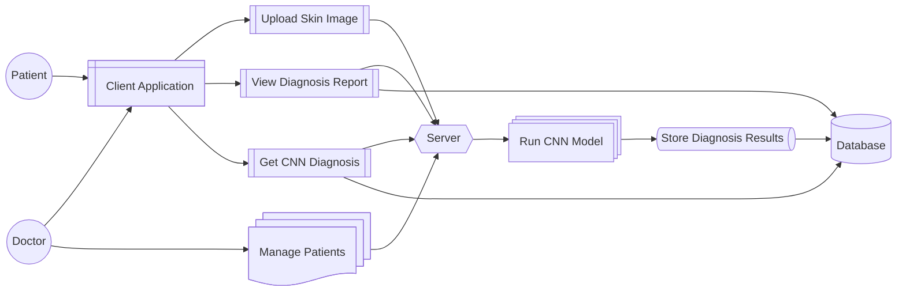
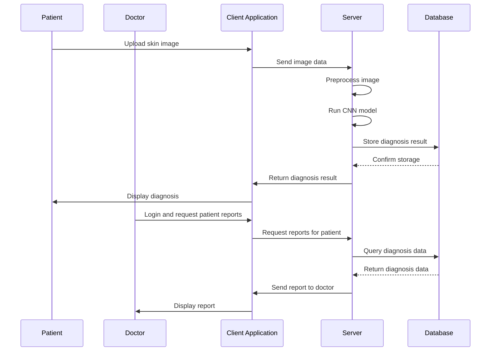
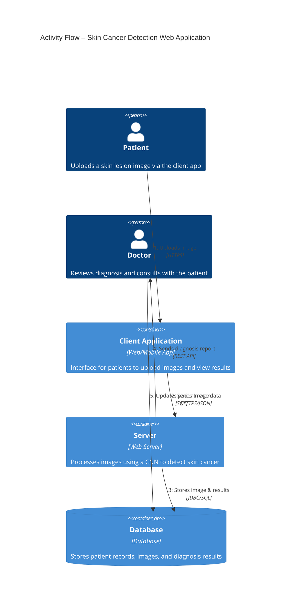

System Design
=============

Overview of Architecture
------------------------

The proposed architecture consists of four deep learning models—EfficientNetV2S, EfficientNetV2M, InceptionResNetV2, and XceptionNet—each trained independently on the HAM10000 dataset. These models are then combined through an ensemble averaging mechanism. The ensemble model takes the dermatoscopic image as input, preprocesses it to match the input dimensions of the models, and feeds it into each network. The resulting predictions are averaged to generate a final output. This ensemble-based approach reduces individual model biases and improves classification robustness. The final model is then integrated into a Gradio web application for real-time use.

Functional Architecture
-----------------------

The system begins with image acquisition through the web interface. The image is preprocessed—resized, normalized, and augmented as needed—before being passed to the ensemble model. Each of the four CNN models processes the image independently, and their outputs are combined. The combined prediction is then decoded into one of the seven skin cancer classes. Finally, the result, including a detailed description of the condition, is displayed to the user. This flow ensures end-to-end automation, from user input to diagnosis delivery.

Transformer Architecture (Reference)
------------------------------------

While not directly used in this project, the Transformer architecture is briefly explored for its potential future use in skin lesion classification. Originally developed for NLP, Transformers have shown success in vision tasks through Vision Transformers (ViT). These models use self-attention mechanisms to understand global image features, making them valuable for detecting skin lesions that vary greatly in appearance. In future enhancements, this architecture may replace or augment CNN-based approaches.

UML Diagrams
------------

### Use Case Diagram ###

This diagram showcases the interaction between the user (dermatologist or patient) and the system. The main use case involves uploading an image and receiving a diagnosis. Other use cases include model training, result viewing, and feedback submission.

### Sequence Diagram ###

This diagram represents the chronological flow: the user uploads an image, the image is processed, predictions are generated by the ensemble model, and the result is returned. It captures the real-time, interactive nature of the system.

### Activity Diagram ###

The activity diagram outlines the complete workflow—from system initialization, image upload, and preprocessing, to prediction generation and display. It provides a visual representation of the logic and sequence of operations, ensuring a clear understanding of system functionality.

